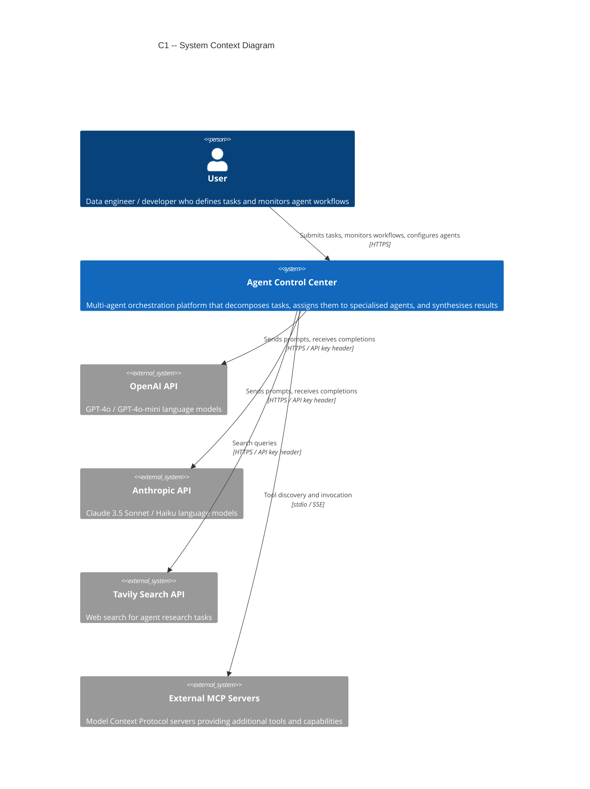
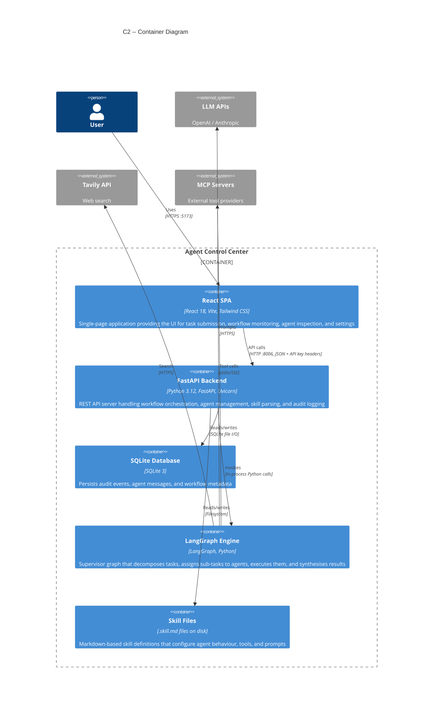
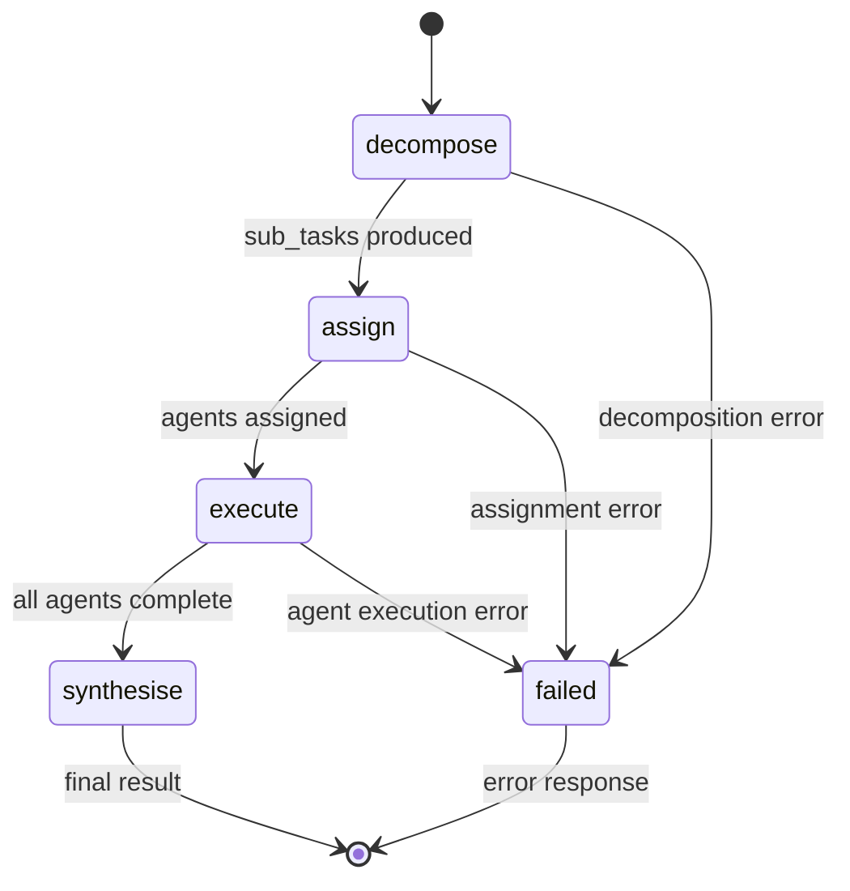
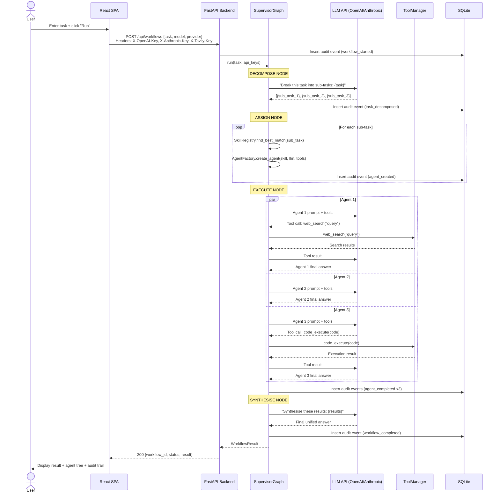
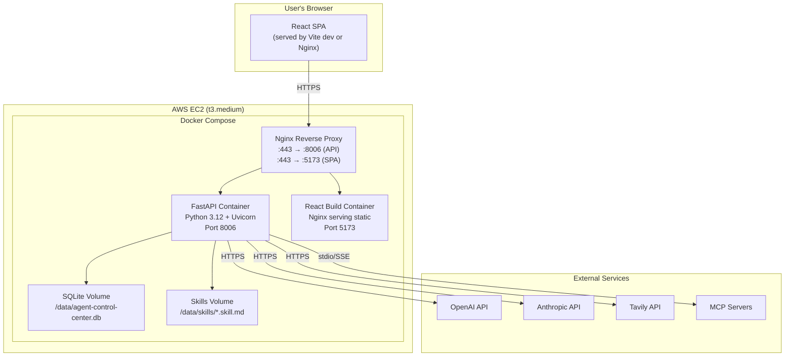

# Agent Control Center -- Architecture Documentation

> Multi-agent orchestration platform built on FastAPI + React + LangGraph.
> Version 2.0 (migrated from Streamlit v1).

---

## Table of Contents

1. [C1 -- System Context](#c1----system-context)
2. [C2 -- Container View](#c2----container-view)
3. [C3 -- Component View (Backend)](#c3----component-view-backend)
4. [C4 -- Code View](#c4----code-view)
5. [Sequence Diagram -- Workflow Execution](#sequence-diagram----workflow-execution)
6. [Deployment View](#deployment-view)
7. [Architecture Decision Records](#architecture-decision-records)

---

## C1 -- System Context

The Agent Control Center sits at the centre of a multi-agent AI orchestration ecosystem. Users interact with it through a browser; it delegates work to external LLM APIs, searches the web via Tavily, and optionally connects to external MCP (Model Context Protocol) servers for extended tool capabilities.



### External Actors

| Actor | Description | Protocol |
|-------|-------------|----------|
| **User** | Interacts via the React SPA in a browser. Provides API keys through the Settings page (stored in `localStorage`). | HTTPS |
| **OpenAI API** | Provides GPT-4o and GPT-4o-mini models for agent reasoning. | HTTPS, key via `X-OpenAI-Key` header |
| **Anthropic API** | Provides Claude 3.5 Sonnet and Haiku models for agent reasoning. | HTTPS, key via `X-Anthropic-Key` header |
| **Tavily Search API** | Powers the `web_search` built-in tool for internet research. | HTTPS, key via `X-Tavily-Key` header |
| **MCP Servers** | External Model Context Protocol servers that expose additional tools beyond the 5 built-in ones. | stdio or SSE transport |

---

## C2 -- Container View



### Container Details

| Container | Technology | Responsibility |
|-----------|-----------|----------------|
| **React SPA** | React 18, Vite, Tailwind CSS, React Router | UI for submitting tasks, viewing workflow progress in real time, inspecting agent trees, managing skills, viewing audit logs, and configuring API keys |
| **FastAPI Backend** | Python 3.12, FastAPI, Uvicorn, Pydantic v2 | REST API with 5 router groups (workflows, agents, skills, audit, settings). Orchestrates the LangGraph engine, manages the agent registry, parses skills, and logs audit events |
| **SQLite Database** | SQLite 3 | Stores audit events (`audit_events` table), agent messages (`agent_messages` table), and workflow run metadata. Auto-created on first startup |
| **LangGraph Engine** | LangGraph (LangChain ecosystem) | Implements the supervisor pattern as a directed graph with nodes: decompose, assign, execute, synthesise. Manages agent lifecycle and tool invocation |
| **Skill Files** | `.skill.md` Markdown files | Declarative skill definitions containing agent name, description, model preference, system prompt, allowed tools, and example tasks. Stored in a configurable directory on disk |

---

## C3 -- Component View (Backend)

```mermaid
C4Component
    title C3 -- Backend Component Diagram

    Container_Boundary(backend, "FastAPI Backend") {
        Component(config, "Config", "Python module", "Loads configuration: ports, paths, model defaults, workspace dir, skill directory")
        Component(llm_provider, "LLMProvider", "Python class", "Factory for OpenAI and Anthropic LLM clients; selects model based on agent skill or default config")
        Component(agent_registry, "AgentRegistry", "Python class", "In-memory registry of active agents; tracks status, parent-child relationships, and metadata")
        Component(agent_factory, "AgentFactory", "Python class", "Creates agent instances with the right LLM, tools, and system prompt based on skill definitions")
        Component(tool_manager, "ToolManager", "Python class", "Registers and provides the 5 built-in tools plus any MCP-sourced tools; enforces sandboxing")
        Component(comm_bus, "CommunicationBus", "Python class", "Message passing between agents; logs all inter-agent messages to the database")
        Component(supervisor, "SupervisorGraph", "LangGraph StateGraph", "Core orchestration graph with decompose, assign, execute, synthesise nodes")
        Component(skill_parser, "SkillParser", "Python class", "Parses .skill.md files into SkillDefinition objects")
        Component(skill_registry, "SkillRegistry", "Python class", "Indexes all parsed skills; provides find_best_match() for task-to-skill mapping")
        Component(audit_logger, "AuditLogger", "Python class", "Writes audit events and agent messages to SQLite with timestamps and metadata")
        Component(database, "Database", "Python module", "SQLAlchemy async engine and session factory for SQLite; auto-creates tables on startup")

        Component(router_workflows, "Workflows Router", "FastAPI Router", "/api/workflows -- submit tasks, list runs, get run details and events")
        Component(router_agents, "Agents Router", "FastAPI Router", "/api/agents -- list agents, get details, view parent-child trees, clear registry")
        Component(router_skills, "Skills Router", "FastAPI Router", "/api/skills -- CRUD for skill definitions, list available tools")
        Component(router_audit, "Audit Router", "FastAPI Router", "/api/audit -- query audit events, messages, and aggregate stats")
        Component(router_settings, "Settings Router", "FastAPI Router", "/api/settings -- config info, health check (validates API key connectivity)")
    }

    Rel(router_workflows, supervisor, "Triggers workflow execution")
    Rel(router_workflows, audit_logger, "Queries events")
    Rel(router_agents, agent_registry, "Queries agent state")
    Rel(router_skills, skill_parser, "Parses uploaded skills")
    Rel(router_skills, skill_registry, "Registers/queries skills")
    Rel(router_audit, audit_logger, "Queries audit data")
    Rel(router_settings, config, "Reads config")

    Rel(supervisor, agent_factory, "Creates agents for sub-tasks")
    Rel(supervisor, llm_provider, "Gets LLM clients")
    Rel(supervisor, tool_manager, "Gets tools for agents")
    Rel(supervisor, comm_bus, "Sends inter-agent messages")
    Rel(supervisor, audit_logger, "Logs execution events")

    Rel(agent_factory, skill_registry, "Looks up skill for task")
    Rel(agent_factory, agent_registry, "Registers new agents")
    Rel(audit_logger, database, "Writes to SQLite")
    Rel(comm_bus, database, "Writes messages to SQLite")
```



### Component Descriptions

| Component | Key Responsibilities |
|-----------|---------------------|
| **Config** | Centralises all configuration: backend port (8006), workspace directory for file I/O, skill file directory, default LLM model and provider, code execution timeout (30s) |
| **LLMProvider** | Abstracts over OpenAI and Anthropic SDKs. Accepts API keys per-request (never stored). Returns a configured LLM client for the requested provider and model |
| **AgentRegistry** | Thread-safe in-memory dictionary of `AgentRecord` objects. Tracks agent status (idle, running, completed, failed), parent-child relationships, assigned tools, and timing |
| **AgentFactory** | Given a sub-task description, finds the best matching skill via `SkillRegistry`, creates an agent with the appropriate LLM, tools, and system prompt, and registers it in the `AgentRegistry` |
| **ToolManager** | Owns the 5 built-in tools (`web_search`, `code_execute`, `file_read`, `file_write`, `api_call`). Integrates MCP-discovered tools. Enforces sandboxing (workspace scoping, execution timeouts) |
| **CommunicationBus** | Facilitates message passing between the supervisor and child agents. All messages are persisted to the `agent_messages` table for auditability |
| **SupervisorGraph** | The heart of the system. A LangGraph `StateGraph` with 4 nodes (decompose, assign, execute, synthesise) connected by conditional edges. Runs the full orchestration loop |
| **SkillParser** | Reads `.skill.md` files and extracts structured `SkillDefinition` objects (name, description, model, tools, system_prompt, examples) from the Markdown front-matter and body |
| **SkillRegistry** | Stores all parsed skills in memory. `find_best_match(task_description)` uses keyword and semantic similarity to select the best skill for a given sub-task |
| **AuditLogger** | Writes timestamped audit events (workflow started, agent created, tool invoked, error occurred, etc.) and agent messages to SQLite. Supports querying by workflow ID, time range, event type |
| **Database** | SQLAlchemy async engine wrapping SQLite. Creates `audit_events` and `agent_messages` tables on startup. Thread-safe via `check_same_thread=False` |
| **Workflows Router** | `POST /api/workflows` (submit task), `GET /api/workflows` (list), `GET /api/workflows/{id}` (detail), `GET /api/workflows/{id}/events`, `GET /api/workflows/{id}/messages` |
| **Agents Router** | `GET /api/agents` (list all), `GET /api/agents/{id}` (detail), `GET /api/agents/{id}/children` (tree), `GET /api/agents/relationships/all` (full graph), `DELETE /api/agents/clear` |
| **Skills Router** | `GET /api/skills` (list), `GET /api/skills/{name}` (detail), `POST /api/skills` (create), `DELETE /api/skills/{name}`, `GET /api/skills/tools/available` |
| **Audit Router** | `GET /api/audit/events` (paginated), `GET /api/audit/messages`, `GET /api/audit/stats` (aggregate counts) |
| **Settings Router** | `GET /api/settings` (current config), `GET /api/settings/health` (validates API key connectivity against LLM providers) |

---

## C4 -- Code View

### supervisor.py -- SupervisorGraph

The supervisor graph is a LangGraph `StateGraph` with four nodes connected linearly with conditional error handling.



#### Key Functions

| Function | Signature | Description |
|----------|-----------|-------------|
| `decompose` | `async def decompose(state: WorkflowState) -> WorkflowState` | Calls the supervisor LLM to break the user's task into a list of `SubTask` objects. Each sub-task has a description, dependencies, and required tool hints. Returns updated state with `sub_tasks` populated. |
| `assign` | `async def assign(state: WorkflowState) -> WorkflowState` | For each sub-task, calls `AgentFactory.create_agent()` which finds the best skill match, selects the LLM and tools, creates an `AgentRecord`, and maps the sub-task to the agent. Returns state with `assignments` populated. |
| `execute` | `async def execute(state: WorkflowState) -> WorkflowState` | Runs all assigned agents concurrently via `asyncio.gather()`. Each agent invocation sends the sub-task description as a user message to its LLM, with tools available for function calling. Collects results or errors. Returns state with `results` populated. |
| `synthesise` | `async def synthesise(state: WorkflowState) -> WorkflowState` | Calls the supervisor LLM with all agent results to produce a unified final answer. Logs the completion event. Returns state with `final_result` populated. |

#### WorkflowState Schema

```python
class WorkflowState(TypedDict):
    task: str                          # Original user task
    sub_tasks: list[SubTask]           # Decomposed sub-tasks
    assignments: dict[str, str]        # sub_task_id -> agent_id
    results: dict[str, AgentResult]    # agent_id -> result
    final_result: str                  # Synthesised final answer
    status: str                        # running | completed | failed
    error: Optional[str]              # Error message if failed
    api_keys: dict[str, str]          # Provider keys for this run
```

### skill_parser.py -- SkillParser and SkillRegistry

#### SkillParser

```python
class SkillParser:
    def parse(self, file_path: Path) -> SkillDefinition:
        """
        Reads a .skill.md file and extracts:
        - YAML front-matter (name, description, model, provider, tools)
        - Markdown body (system_prompt, examples)
        Returns a SkillDefinition dataclass.
        """
```

#### SkillRegistry

```python
class SkillRegistry:
    def __init__(self):
        self._skills: dict[str, SkillDefinition] = {}

    def register(self, skill: SkillDefinition) -> None:
        """Add a skill to the registry, keyed by name."""

    def get(self, name: str) -> Optional[SkillDefinition]:
        """Retrieve a skill by exact name."""

    def find_best_match(self, task_description: str) -> Optional[SkillDefinition]:
        """
        Find the best skill for a task using keyword matching
        against skill descriptions and example tasks.
        Returns None if no skill scores above the threshold.
        """

    def list_all(self) -> list[SkillDefinition]:
        """Return all registered skills."""
```

#### SkillDefinition Schema

```python
@dataclass
class SkillDefinition:
    name: str                  # e.g. "code_reviewer"
    description: str           # Human-readable description
    model: str                 # e.g. "gpt-4o", "claude-3-5-sonnet"
    provider: str              # "openai" | "anthropic"
    tools: list[str]           # e.g. ["code_execute", "file_read"]
    system_prompt: str         # Full system prompt for the agent
    examples: list[str]        # Example task descriptions for matching
```

---

## Sequence Diagram -- Workflow Execution



---

## Deployment View



### Local Development

| Component | Command | Port |
|-----------|---------|------|
| Backend | `cd backend && PYTHONPATH=src .venv/bin/uvicorn agentcontrol.main:app --reload --port 8006` | 8006 |
| Frontend | `cd frontend && npm run dev` | 5173 |

### Production (Docker)

The application is containerised with Docker Compose on the consolidated AWS EC2 instance. Nginx serves as the reverse proxy with Let's Encrypt SSL. The SQLite database and skill files are mounted as Docker volumes for persistence across container restarts.

---

## Architecture Decision Records

### ADR-001: Migrate from Streamlit to FastAPI + React

**Status:** Accepted

**Context:** The v1 prototype used Streamlit for rapid development. As the application grew, Streamlit's limitations became blockers: no fine-grained state management, limited layout control, full page re-renders on every interaction, and difficulty implementing real-time updates for concurrent agent execution.

**Decision:** Migrate to FastAPI (backend) + React 18 with Vite (frontend). FastAPI provides async support essential for concurrent agent execution, proper REST API design, and Pydantic validation. React provides component-level re-rendering, React Router for multi-page navigation, and Tailwind CSS for consistent styling.

**Consequences:**
- Positive: Full control over UI/UX, proper API separation, async agent execution, better testability.
- Negative: Higher initial development effort, two processes to run locally.

---

### ADR-002: API Keys via HTTP Headers (Not .env)

**Status:** Accepted

**Context:** In v1, API keys were stored in `.env` files on the server. This created security concerns: keys persisted on disk, were shared across users, and required server restarts to update.

**Decision:** API keys are entered by the user in the Settings page UI, stored in browser `localStorage`, and sent per-request via HTTP headers (`X-OpenAI-Key`, `X-Anthropic-Key`, `X-Tavily-Key`). The server never persists keys to disk or database.

**Consequences:**
- Positive: Keys never touch the server filesystem, each user can use their own keys, no server restart needed to change keys, follows BYOK (Bring Your Own Key) pattern.
- Negative: Keys must be re-entered if localStorage is cleared, keys are visible in browser dev tools (mitigated by HTTPS).

---

### ADR-003: LangGraph Supervisor Pattern for Orchestration

**Status:** Accepted

**Context:** The system needs to decompose complex tasks into sub-tasks, assign them to specialised agents, execute them (potentially in parallel), and synthesise results. Options considered: custom orchestration loop, CrewAI, AutoGen, LangGraph.

**Decision:** Use LangGraph's `StateGraph` to implement a supervisor pattern with four nodes (decompose, assign, execute, synthesise). LangGraph provides a well-defined state machine abstraction, supports conditional edges for error handling, and integrates naturally with LangChain's LLM and tool abstractions.

**Consequences:**
- Positive: Clean separation of orchestration phases, built-in state management, easy to add new nodes or conditional branches, good observability via state inspection.
- Negative: Dependency on the LangChain ecosystem, learning curve for LangGraph's graph construction API.

---

### ADR-004: SQLite for Audit Logging and Persistence

**Status:** Accepted

**Context:** The system needs to persist audit events, agent messages, and workflow metadata. Requirements: simple setup, no external dependencies, adequate for single-machine deployment.

**Decision:** Use SQLite via SQLAlchemy async with `aiosqlite`. The database file is auto-created on first startup. Two tables: `audit_events` and `agent_messages`.

**Consequences:**
- Positive: Zero configuration, single-file database, easy to back up, sufficient performance for expected load (hundreds of workflows per day).
- Negative: Single-writer limitation, not suitable for multi-instance deployment without migration to PostgreSQL. See constraints.md for upgrade path.

---

### ADR-005: Skill Definitions as .skill.md Markdown Files

**Status:** Accepted

**Context:** Agent skills need to be user-configurable without code changes. Options: database records, JSON/YAML config files, custom DSL, Markdown files.

**Decision:** Use `.skill.md` files with YAML front-matter for structured metadata (name, description, model, tools) and Markdown body for the system prompt and examples. Files are stored in a configurable directory and parsed at startup and on-demand.

**Consequences:**
- Positive: Human-readable and editable, version-controllable with Git, easy to share and import, no database migration needed to add skills.
- Negative: Filesystem-based storage means no built-in search or indexing (mitigated by in-memory SkillRegistry), file conflicts possible if edited concurrently (unlikely in practice).
