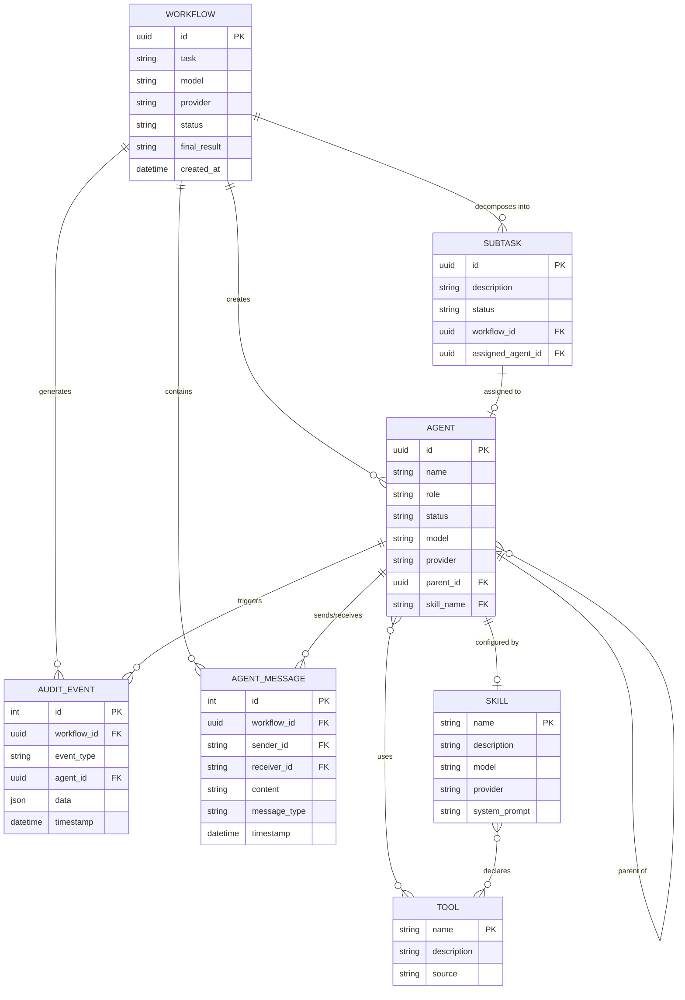
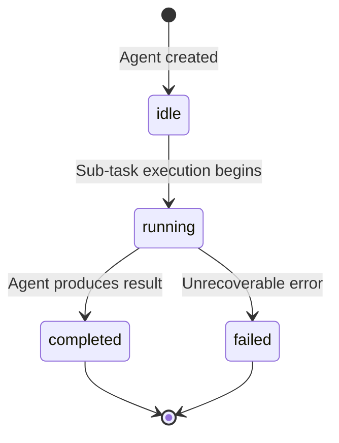
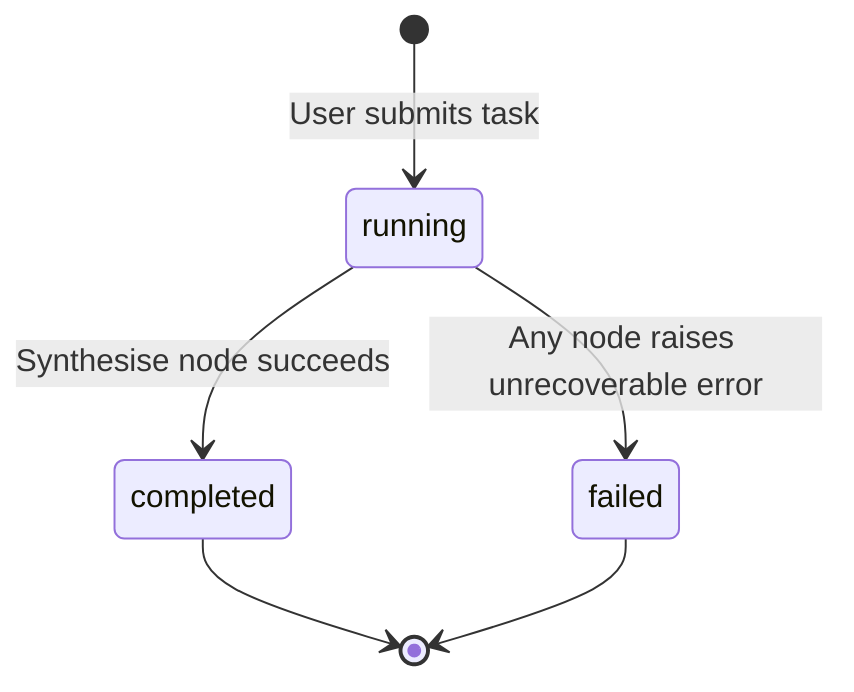
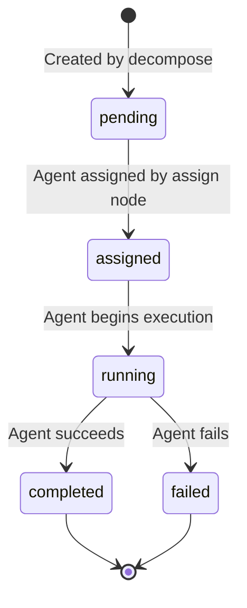

# Agent Control Center -- Domain Model

---

## Table of Contents

1. [Entity Definitions](#entity-definitions)
2. [Entity Relationship Diagram](#entity-relationship-diagram)
3. [State Machines](#state-machines)
4. [Glossary](#glossary)

---

## Entity Definitions

### Workflow

A single end-to-end execution of a user's task. Created when the user submits a task via the UI. Contains the original task description, decomposed sub-tasks, agent assignments, collected results, and the final synthesised answer.

| Field | Type | Description |
|-------|------|-------------|
| `id` | UUID | Unique workflow identifier |
| `task` | string | Original user-submitted task description |
| `model` | string | LLM model used for the supervisor (e.g. `gpt-4o`) |
| `provider` | string | LLM provider (`openai` or `anthropic`) |
| `status` | WorkflowStatus | Current execution status |
| `sub_tasks` | list[SubTask] | Decomposed sub-tasks |
| `assignments` | dict[str, str] | Mapping of sub_task_id to agent_id |
| `results` | dict[str, AgentResult] | Mapping of agent_id to execution result |
| `final_result` | string | Synthesised final answer |
| `error` | string (nullable) | Error message if workflow failed |
| `created_at` | datetime | Workflow creation timestamp |
| `completed_at` | datetime (nullable) | Workflow completion timestamp |

### SubTask

A discrete unit of work produced by the decompose phase of the supervisor graph. Each sub-task is assigned to exactly one agent.

| Field | Type | Description |
|-------|------|-------------|
| `id` | UUID | Unique sub-task identifier |
| `description` | string | What the agent should accomplish |
| `dependencies` | list[str] | IDs of sub-tasks that must complete first |
| `tool_hints` | list[str] | Suggested tools (e.g. `["web_search"]`) |
| `status` | SubTaskStatus | Current status |
| `assigned_agent_id` | string (nullable) | ID of the assigned agent |

### Agent (AgentRecord)

An in-memory record representing a specialised AI agent created for a specific sub-task. Tracked in the AgentRegistry.

| Field | Type | Description |
|-------|------|-------------|
| `id` | UUID | Unique agent identifier |
| `name` | string | Human-readable name (from skill or auto-generated) |
| `role` | string | Agent's role description |
| `status` | AgentStatus | Current lifecycle status |
| `parent_id` | string (nullable) | ID of the supervisor/parent agent |
| `children_ids` | list[str] | IDs of child agents (if supervisor) |
| `skill_name` | string (nullable) | Name of the matched skill |
| `model` | string | LLM model being used |
| `provider` | string | LLM provider |
| `tools` | list[str] | Names of tools available to this agent |
| `created_at` | datetime | Agent creation timestamp |
| `completed_at` | datetime (nullable) | Agent completion timestamp |
| `result` | string (nullable) | Agent's output |
| `error` | string (nullable) | Error message if agent failed |

### Skill (SkillDefinition)

A declarative definition of an agent's capabilities, loaded from a `.skill.md` file.

| Field | Type | Description |
|-------|------|-------------|
| `name` | string | Unique skill identifier (e.g. `code_reviewer`) |
| `description` | string | Human-readable description of what this skill does |
| `model` | string | Preferred LLM model for this skill |
| `provider` | string | Preferred LLM provider |
| `tools` | list[string] | Tools this skill is allowed to use |
| `system_prompt` | string | Full system prompt injected into the agent |
| `examples` | list[string] | Example task descriptions for matching |

### AuditEvent

A timestamped record of a significant event during workflow execution. Persisted to SQLite.

| Field | Type | Description |
|-------|------|-------------|
| `id` | integer (auto) | Primary key |
| `workflow_id` | UUID | Associated workflow |
| `event_type` | string | Event category (e.g. `workflow_started`, `agent_created`, `tool_invoked`, `agent_completed`, `workflow_completed`, `error`) |
| `agent_id` | string (nullable) | Associated agent, if applicable |
| `data` | JSON | Event-specific payload |
| `timestamp` | datetime | When the event occurred |

### AgentMessage

A message exchanged between agents or between the supervisor and an agent. Persisted to SQLite.

| Field | Type | Description |
|-------|------|-------------|
| `id` | integer (auto) | Primary key |
| `workflow_id` | UUID | Associated workflow |
| `sender_id` | string | Agent ID of the sender |
| `receiver_id` | string | Agent ID of the receiver |
| `content` | string | Message content |
| `message_type` | string | `task_assignment`, `result`, `error`, `info` |
| `timestamp` | datetime | When the message was sent |

### Tool

A callable capability available to agents. The system provides 5 built-in tools plus any discovered via MCP.

| Tool Name | Description | Constraints |
|-----------|-------------|-------------|
| `web_search` | Search the web via Tavily API | Requires `X-Tavily-Key` header |
| `code_execute` | Execute Python code in a sandboxed subprocess | 30-second timeout, no network access |
| `file_read` | Read a file from the workspace directory | Scoped to `workspace/` directory only |
| `file_write` | Write a file to the workspace directory | Scoped to `workspace/` directory only |
| `api_call` | Make an HTTP request to an external API | GET/POST/PUT/DELETE, configurable timeout |

---

## Entity Relationship Diagram

---

## State Machines

### AgentStatus

| State | Description |
|-------|-------------|
| `idle` | Agent has been created and registered but has not started executing its sub-task |
| `running` | Agent is actively processing its sub-task (LLM calls, tool invocations) |
| `completed` | Agent has successfully produced a result |
| `failed` | Agent encountered an error and could not complete its sub-task |

### WorkflowStatus

| State | Description |
|-------|-------------|
| `running` | Workflow is actively being processed (decompose, assign, execute, or synthesise phase) |
| `completed` | All phases succeeded and a final result has been synthesised |
| `failed` | An error occurred in any phase that could not be recovered |

### SubTaskStatus

| State | Description |
|-------|-------------|
| `pending` | Sub-task has been created but no agent has been assigned yet |
| `assigned` | An agent has been assigned but execution has not started |
| `running` | The assigned agent is actively working on this sub-task |
| `completed` | The sub-task has been completed successfully |
| `failed` | The sub-task failed due to an agent error |

---

## Glossary

| Term | Definition |
|------|-----------|
| **Agent** | An autonomous AI entity configured with a specific LLM, tools, and system prompt to accomplish a sub-task. Agents are ephemeral (created per workflow run). |
| **Agent Registry** | In-memory store that tracks all active agents, their statuses, and parent-child relationships. |
| **Audit Event** | A persisted record of a significant system event (workflow start, agent creation, tool invocation, completion, failure). |
| **BYOK** | Bring Your Own Key. Users provide their own API keys for LLM and search providers. Keys are stored only in the browser. |
| **Communication Bus** | Internal message-passing mechanism between agents. All messages are persisted for auditability. |
| **Decompose** | The first phase of workflow execution where the supervisor LLM breaks a complex task into discrete sub-tasks. |
| **LangGraph** | A library from the LangChain ecosystem for building stateful, graph-based agent workflows. Used to implement the supervisor pattern. |
| **MCP** | Model Context Protocol. An open standard for connecting AI agents to external tool providers. Supports stdio and SSE transports. |
| **Skill** | A declarative configuration (`.skill.md` file) that defines an agent's specialisation: which model to use, which tools to allow, and what system prompt to inject. |
| **Sub-Task** | A discrete unit of work produced by task decomposition. Each sub-task is assigned to exactly one agent. |
| **Supervisor** | The top-level orchestration agent that decomposes tasks, assigns agents, monitors execution, and synthesises results. Implemented as a LangGraph StateGraph. |
| **Synthesise** | The final phase of workflow execution where the supervisor LLM combines all agent results into a unified answer. |
| **Tool** | A callable function available to agents. The system provides 5 built-in tools and can discover additional tools via MCP. |
| **Workflow** | A complete end-to-end execution: from user task submission through decomposition, agent execution, and synthesis to final result. |
| **Workspace** | A scoped directory on the server filesystem where `file_read` and `file_write` tools operate. Agents cannot access files outside this directory. |
