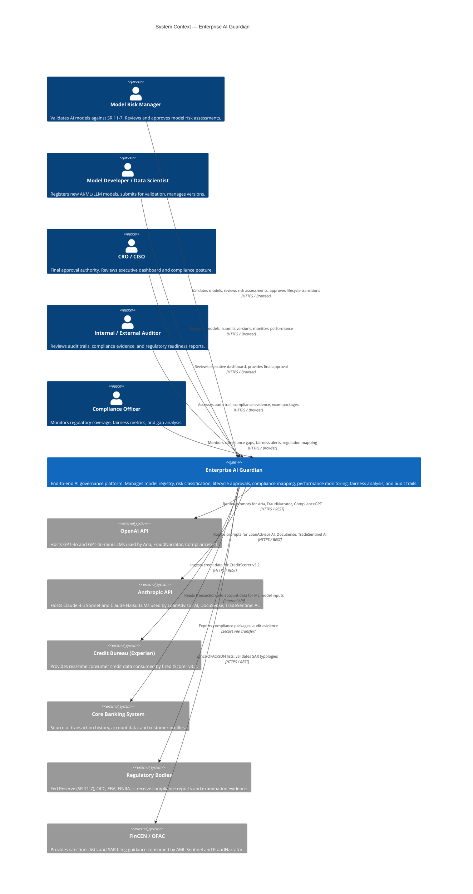

# C1 — System Context Diagram

> **C4 Level 1**: Shows Enterprise AI Guardian in relation to its users and external systems.
> Scope: The entire AI Governance platform as a single black box.

---



---

## System Responsibilities

| Responsibility | Description |
|---|---|
| **Model Registry** | Single inventory of all AI/ML/LLM models with full metadata, versioning, and data lineage |
| **Risk Classification** | Automated Tier 1/2/3 risk scoring per SR 11-7 methodology |
| **Lifecycle Governance** | Role-gated workflow from Development → Validation → MRM Review → Approved → Production → Retired |
| **Compliance Mapping** | Model ↔ Regulation ↔ Control checklist with gap analysis and exam-ready reporting |
| **Performance Monitoring** | Time-series tracking of AUC/PSI/Gini (ML) and hallucination/relevance/cost (LLM) |
| **Fairness & Bias** | ECOA-mandated disparate impact analysis with breach detection across protected classes |
| **Audit Trail** | Immutable, timestamped log of every model action — regulator-ready |
| **Incident Management** | Track, assign, and resolve model failures, bias events, and security findings |

## Users & Roles

| Role | Primary Actions | Access Level |
|---|---|---|
| Model Developer | Register, version, submit for validation | Read/Write own models |
| Model Risk Manager | Validate models, approve lifecycle transitions | Read all, write lifecycle |
| CRO / CISO | Final approval, dashboard review | Read all, write approvals |
| Compliance Officer | Monitor compliance, manage controls | Read all, write compliance |
| Internal Auditor | Review audit trails, generate reports | Read-only |
| External Auditor / Examiner | Access exam package exports | Scoped read-only |

## Regulatory Boundary

Enterprise AI Guardian operates within the following regulatory perimeter:

```
┌─────────────────────────────────────────────────────────────────┐
│  US Jurisdiction          │  EU Jurisdiction    │  Global       │
│  ─────────────────────    │  ─────────────────  │  ──────────   │
│  SR 11-7 (Fed Reserve)    │  EU AI Act          │  Basel III/IV │
│  OCC 2011-12              │  DORA               │               │
│  ECOA / Reg B             │                     │               │
│  FCRA                     │                     │               │
│  BSA / AML (FinCEN)       │                     │               │
│  FINRA Rules              │                     │               │
└─────────────────────────────────────────────────────────────────┘
```
