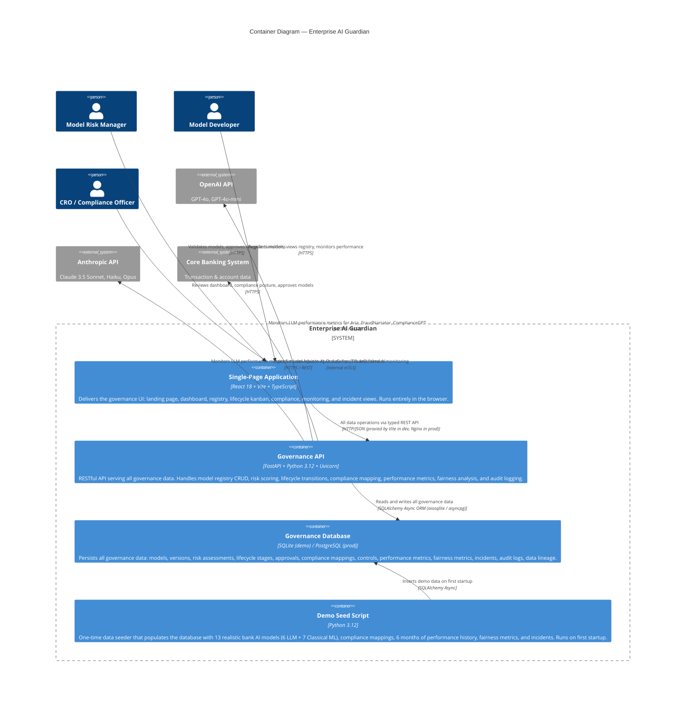

# C2 — Container Diagram

> **C4 Level 2**: Zooms into Enterprise AI Guardian showing the major deployable units (containers),
> their responsibilities, technologies, and communication paths.

---



---

## Container Specifications

### Single-Page Application (SPA)

| Attribute | Value |
|---|---|
| **Framework** | React 18.3 + TypeScript 5.6 |
| **Build tool** | Vite 5.4 |
| **Styling** | Tailwind CSS 3.4 |
| **Charts** | Recharts 2.13 |
| **Icons** | Lucide React 0.462 |
| **Routing** | React Router DOM 6.26 |
| **API client** | Custom typed fetch wrapper (`src/lib/api.ts`) |
| **Dev port** | 5173 (Vite proxy `/api` → `:8000`) |
| **Prod serving** | Static files via Nginx or CDN |

**Pages:**

| Route | Component | Purpose |
|---|---|---|
| `/` | `Landing.tsx` | Pitch landing page — lifecycle flowchart, capability grid, regulatory coverage |
| `/dashboard` | `Dashboard.tsx` | Executive summary — stats, lifecycle pipeline, governance radar, risk heatmap |
| `/models` | `ModelRegistry.tsx` | Searchable/filterable model inventory table |
| `/models/:id` | `ModelDetail.tsx` | Full model profile — risk, lifecycle, LLM details, lineage, versions, audit |
| `/risk` | `RiskAssessment.tsx` | Risk matrix scatter, full tier table |
| `/lifecycle` | `Lifecycle.tsx` | Kanban board (Dev → Retired) |
| `/compliance` | `Compliance.tsx` | Compliance overview, gap analysis, regulation cards |
| `/monitoring` | `Monitoring.tsx` | Performance charts (AUC/PSI/Hallucination), fairness table, alerts |
| `/incidents` | `Incidents.tsx` | Severity-sorted incident cards |

---

### Governance API

| Attribute | Value |
|---|---|
| **Framework** | FastAPI 0.115 |
| **Runtime** | Python 3.12 + Uvicorn 0.30 |
| **ORM** | SQLAlchemy 2.0 (async) |
| **Async driver** | aiosqlite 0.20 (dev) / asyncpg (prod) |
| **Validation** | Pydantic v2 |
| **CORS** | Configured for `localhost:5173` (dev) |
| **Port** | 8000 |
| **Docs** | Auto-generated at `/docs` (Swagger) and `/redoc` |

**Router modules:**

| Module | Prefix | Responsibility |
|---|---|---|
| `routers/dashboard.py` | `/api/dashboard` | Summary stats, risk heatmap |
| `routers/models.py` | `/api/models` | Registry CRUD, detail, audit trail |
| `routers/risk.py` | `/api/risk` | Risk assessments, risk matrix |
| `routers/lifecycle.py` | `/api/lifecycle` | Kanban board data |
| `routers/compliance.py` | `/api/compliance` | Overview, gap analysis, controls, regulations |
| `routers/monitoring.py` | `/api/monitoring` | Performance metrics, fairness, alerts |
| `routers/incidents.py` | `/api/incidents` | Incident list |

---

### Governance Database

| Attribute | Value |
|---|---|
| **Demo engine** | SQLite 3 (`governance.db`) |
| **Production engine** | PostgreSQL 15+ (recommended) |
| **ORM** | SQLAlchemy Declarative Mapped Columns |
| **Migration tool** | Alembic (recommended for prod) |
| **Tables** | 13 (see Domain Model doc) |
| **Seed data** | 13 AI models, ~200 compliance controls, 6× monthly metrics, 4× fairness records per lending model |

---

## Communication Protocols

```
Browser ──HTTPS──▶ Nginx (prod) ──proxy──▶ FastAPI :8000
                      │
                  Static files ──▶ React SPA

FastAPI ──SQLAlchemy async──▶ SQLite / PostgreSQL

FastAPI ──HTTPS/REST──▶ OpenAI API  (monitoring hooks)
         ──HTTPS/REST──▶ Anthropic API
         ──mTLS──▶ Core Banking System
```

## Deployment Topology (Production Target)

```
┌──────────────────────────────────────────────────────┐
│  Kubernetes Cluster / Docker Compose                  │
│                                                        │
│  ┌─────────────────┐    ┌──────────────────────────┐  │
│  │   Nginx Pod      │    │    FastAPI Pod(s)         │  │
│  │  (React SPA +    │───▶│  governance.main:app     │  │
│  │   Reverse Proxy) │    │  Uvicorn workers: 4      │  │
│  └─────────────────┘    └────────────┬─────────────┘  │
│                                       │                 │
│                          ┌────────────▼─────────────┐  │
│                          │    PostgreSQL Pod         │  │
│                          │    governance_db          │  │
│                          └──────────────────────────┘  │
└──────────────────────────────────────────────────────┘
```
