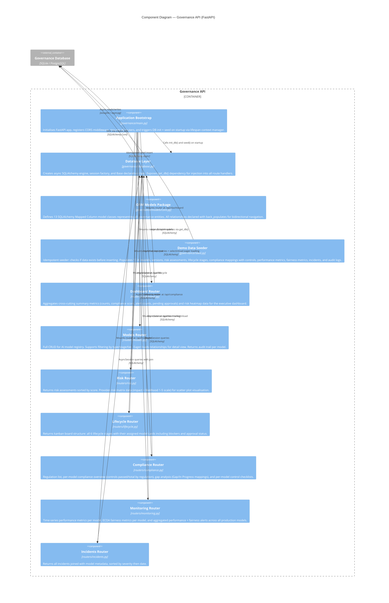
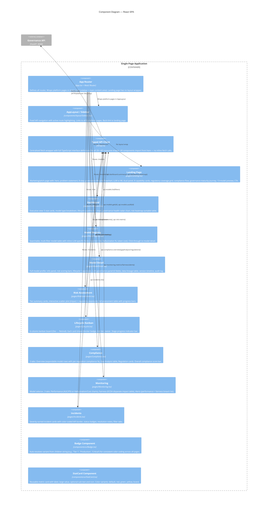
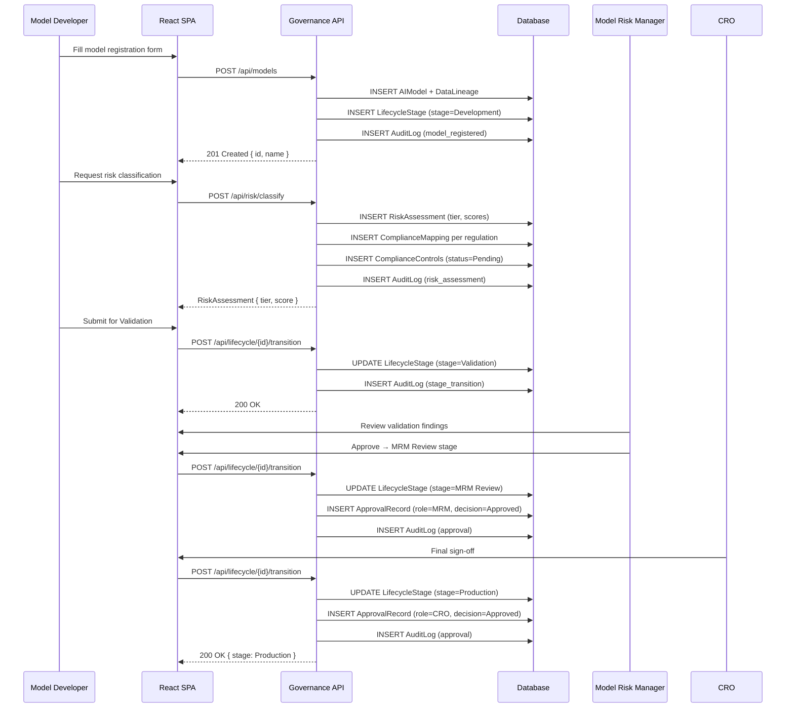
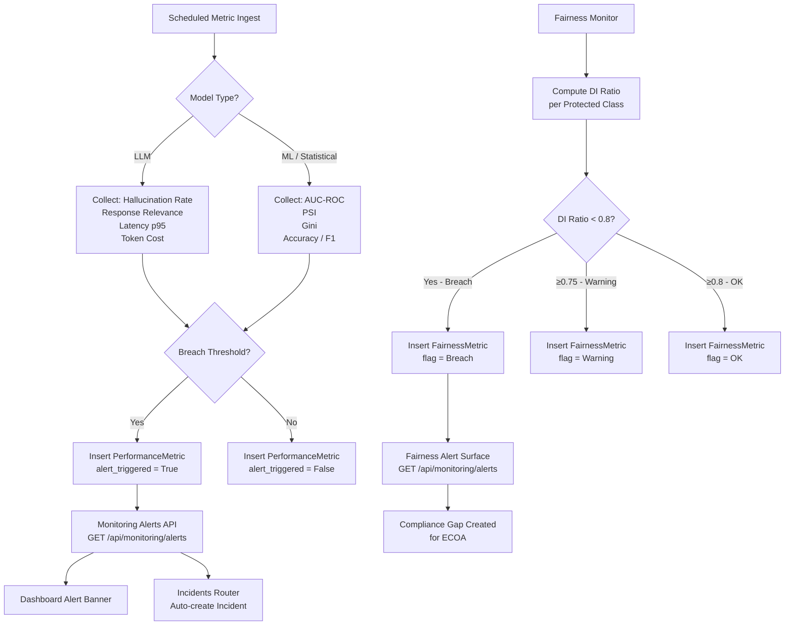

# C3 — Component Diagrams

> **C4 Level 3**: Zooms into individual containers showing internal components,
> their responsibilities, and interactions.

---

## 3.1 Governance API — Internal Components

---

## 3.2 React SPA — Internal Components

---

## 3.3 Data Flow: Model Registration to Approval

---

## 3.4 Monitoring Alert Flow

