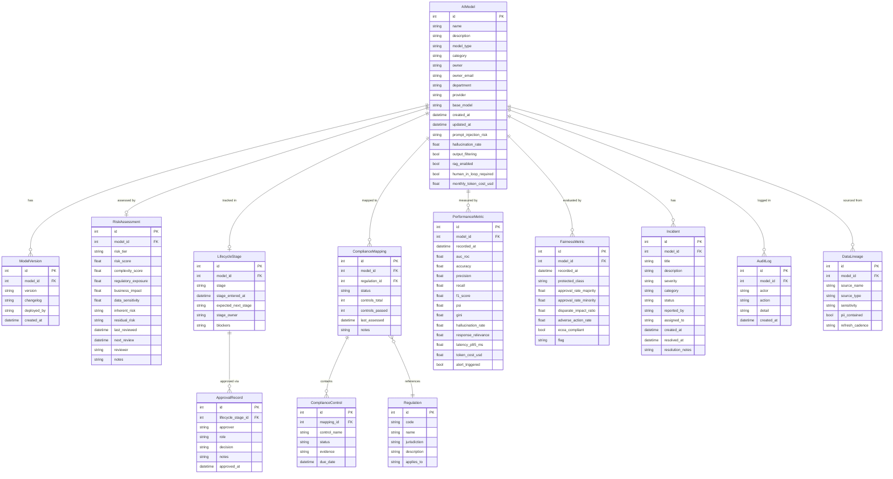
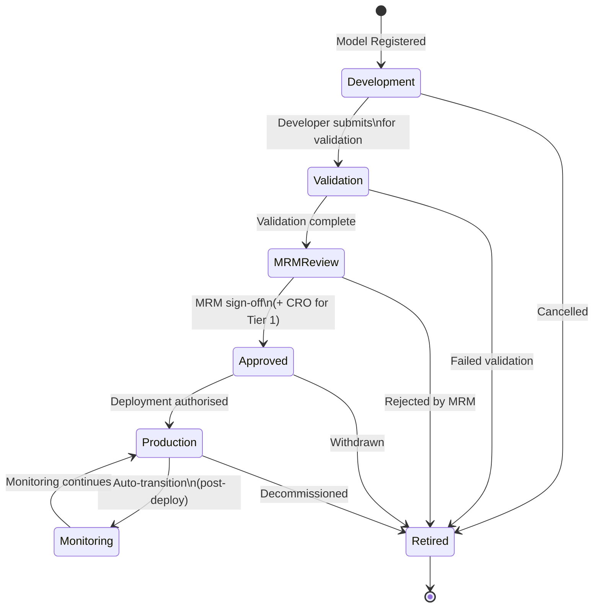

# Domain Model — Enterprise AI Guardian

> Defines the core business domain, bounded contexts, entity relationships,
> and the ubiquitous language used throughout the platform.

---

## Ubiquitous Language

| Term | Definition |
|---|---|
| **AI Model** | Any artificial intelligence system (LLM, ML, or Statistical) used in bank operations |
| **Model Registry** | Authoritative inventory of all AI models — the single source of truth |
| **Model Card** | Structured metadata record for an AI model (purpose, owner, data sources, risks) |
| **Risk Tier** | SR 11-7 classification: Tier 1 (High), Tier 2 (Medium), Tier 3 (Low) |
| **Lifecycle Stage** | Current phase in the model governance pipeline |
| **MRM** | Model Risk Management / Model Risk Manager |
| **Validation** | Independent assessment of model conceptual soundness and limitations |
| **Approval Record** | Immutable sign-off by an authorised role at a lifecycle transition point |
| **Compliance Mapping** | Association of a model to a regulatory framework with a control checklist |
| **Control** | An individual governance requirement that must be evidenced as Pass/Fail |
| **Gap** | A compliance mapping where < 70% of controls are passing |
| **PSI** | Population Stability Index — measures input data distribution drift (> 0.2 = significant) |
| **Disparate Impact (DI)** | Ratio of minority to majority approval rates; < 0.8 = ECOA adverse impact |
| **Incident** | A tracked model failure, bias event, security finding, or performance degradation |
| **Audit Log** | Immutable, timestamped record of every governance action on a model |
| **Data Lineage** | The upstream data sources that feed a model's inputs |
| **Hallucination Rate** | % of LLM outputs flagged as factually incorrect or unsupported |
| **RAG** | Retrieval-Augmented Generation — grounding LLM responses with document context |
| **Human-in-Loop** | Requirement for a human reviewer to validate model outputs before action |
| **Champion/Challenger** | Production (champion) vs experimental (challenger) model comparison framework |

---

## Bounded Contexts

```
┌─────────────────────────────────────────────────────────────────────────────┐
│                         GOVERNANCE DOMAIN                                    │
│                                                                               │
│  ┌──────────────────┐   ┌──────────────────┐   ┌──────────────────────────┐ │
│  │   REGISTRY       │   │   RISK           │   │   LIFECYCLE              │ │
│  │   CONTEXT        │   │   CONTEXT        │   │   CONTEXT                │ │
│  │                  │   │                  │   │                          │ │
│  │  AIModel         │◀──│  RiskAssessment  │   │  LifecycleStage          │ │
│  │  ModelVersion    │   │  RiskTier        │   │  ApprovalRecord          │ │
│  │  DataLineage     │   │  RiskScore       │   │  StageTransition         │ │
│  └──────┬───────────┘   └──────────────────┘   └──────────────────────────┘ │
│         │                                                                     │
│  ┌──────▼───────────┐   ┌──────────────────┐   ┌──────────────────────────┐ │
│  │   COMPLIANCE     │   │   MONITORING     │   │   INCIDENT               │ │
│  │   CONTEXT        │   │   CONTEXT        │   │   CONTEXT                │ │
│  │                  │   │                  │   │                          │ │
│  │  ComplianceMap   │   │  PerformMetric   │   │  Incident                │ │
│  │  Regulation      │   │  FairnessMetric  │   │  AuditLog                │ │
│  │  Control         │   │  Alert           │   │  Resolution              │ │
│  └──────────────────┘   └──────────────────┘   └──────────────────────────┘ │
└─────────────────────────────────────────────────────────────────────────────┘
```

---

## Entity Relationship Diagram



---

## Aggregate Roots & Invariants

### AIModel (Aggregate Root)
The central entity. All other entities are accessed through or related to an `AIModel`.

**Invariants:**
- `model_type` must be one of `LLM | ML | STATISTICAL`
- LLM-specific fields (`prompt_injection_risk`, `hallucination_rate`, etc.) are only meaningful when `model_type = LLM`
- A model can only have **one** `RiskAssessment` and **one** `LifecycleStage` at a time
- Deleting an `AIModel` cascades to all related entities

### LifecycleStage (Entity)
Tracks the current governance stage of a model.

**Invariants:**
- Stage must follow the defined sequence (no skipping mandatory stages)
- Every stage transition must generate an `AuditLog` entry
- `Production` stage requires at least one `MRM` and one `CRO` `ApprovalRecord` with `decision = Approved`

### ComplianceMapping (Entity)
Associates a model with a regulation and tracks control evidence.

**Invariants:**
- `status` is derived: `Compliant` (all controls Pass) · `In Progress` (≥70% Pass) · `Gap` (<70% Pass)
- `controls_passed` must equal count of `ComplianceControl` with `status = Pass`
- Changing a `ComplianceControl` status must recalculate parent `ComplianceMapping.status`

### AuditLog (Value Object — Immutable)
**Invariants:**
- Records are **never updated or deleted** — append-only
- Every `LifecycleStage` transition, `ApprovalRecord` creation, and model registration must generate a log entry

---

## Domain Events

| Event | Trigger | Downstream Effects |
|---|---|---|
| `ModelRegistered` | `POST /api/models` | Create `LifecycleStage(Development)`, generate `AuditLog` |
| `RiskAssessmentCompleted` | `POST /api/risk/classify` | Auto-map regulations, generate `ComplianceMapping` + `ComplianceControl` records |
| `StageTransitioned` | `POST /api/lifecycle/{id}/transition` | Update `LifecycleStage`, generate `AuditLog`, notify pending approvers |
| `ApprovalGranted` | `POST /api/lifecycle/{id}/approve` | Create `ApprovalRecord`, evaluate if stage-completion criteria met |
| `PerformanceAlertTriggered` | Monitoring ingest | Set `PerformanceMetric.alert_triggered=True`, surface in alerts API |
| `FairnessBreachDetected` | Fairness monitor | Set `FairnessMetric.flag=Breach`, create `Incident(severity=Critical, category=Bias)` |
| `ControlStatusUpdated` | `PATCH /api/compliance/controls/{id}` | Recalculate `ComplianceMapping.controls_passed` and `status` |
| `IncidentCreated` | `POST /api/incidents` | Generate `AuditLog` |

---

## Model Type Taxonomy

```
AI Model
├── LLM (Large Language Model)
│   ├── Customer Service          → Aria
│   ├── Lending Decision Support  → LoanAdvisor AI
│   ├── Document Processing       → DocuSense
│   ├── Compliance Assistant      → ComplianceGPT
│   ├── Fraud / AML Narration     → FraudNarrator
│   └── Trading Surveillance      → TradeSentinel AI
│
├── ML (Machine Learning)
│   ├── Credit Scoring            → CreditScorer v3.2
│   ├── Fraud Detection           → FraudShield
│   ├── AML Monitoring            → AML Sentinel
│   ├── Property Valuation        → CollateralVal
│   ├── Customer Retention        → ChurnPredictor
│   └── Trading Signal            → MarketSignal (Retired)
│
└── Statistical
    └── Capital / IRB             → CapitalCalc IRB
```

## Lifecycle State Machine


