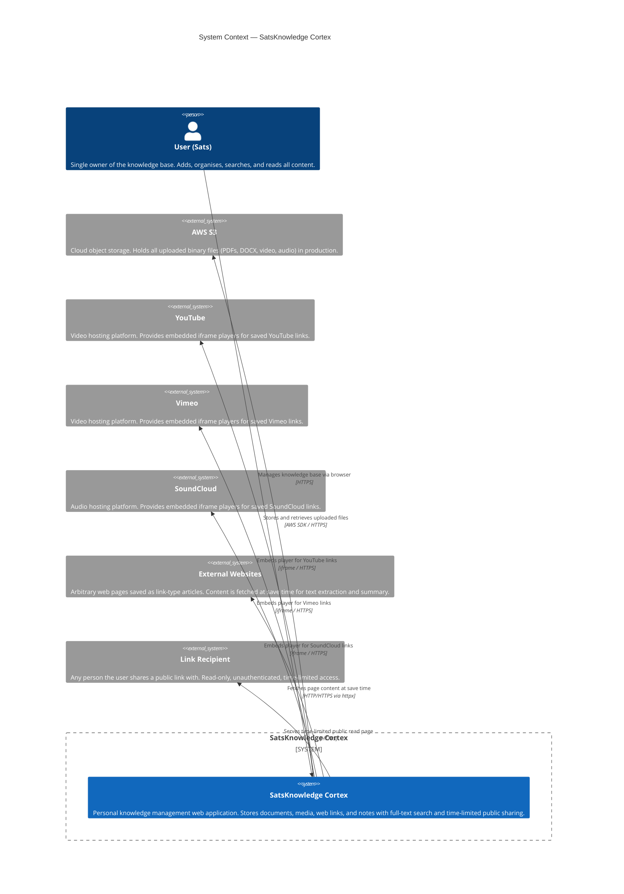

# C1 — System Context

> **Scope:** The entire SatsKnowledge Cortex system and everything it talks to.

## Key Design Decisions at This Level

| Decision | Choice | Rationale |
|---|---|---|
| Authentication | None | Single-user personal tool; no auth overhead needed |
| Cloud storage | AWS S3 (prod) / local filesystem (dev) | Free-tier S3 sufficient; local filesystem for zero-cost dev |
| Link archiving | Fetch + store text at save time | Full-text search works offline; no crawl quota issues |
| Media embeds | Delegated to hosting platform iframes | No video transcoding or hosting cost |
| Public sharing | Server-rendered HTML page, 30-min expiry token | No login required for recipients; automatic expiry prevents link rot |
