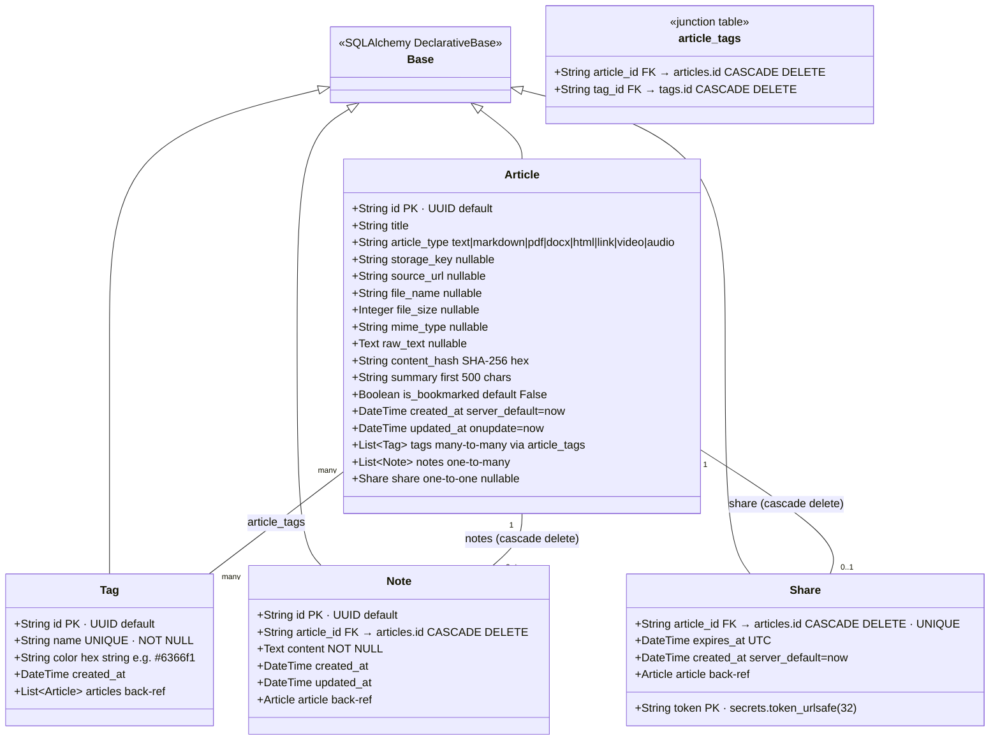
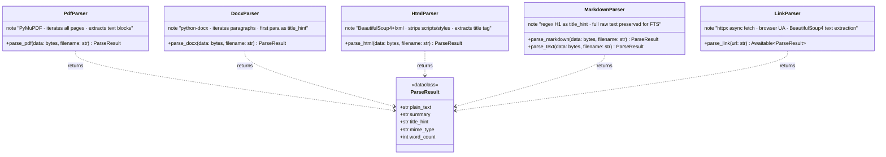
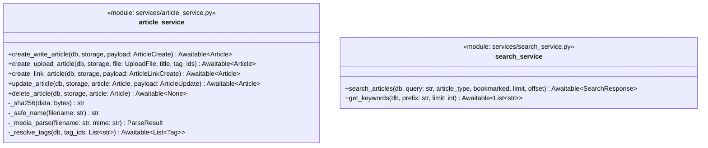

# C4 — Code Diagram

> **Scope:** Key classes and functions within the most critical backend components.
> Focus areas: ORM models, storage abstraction, parser contract, service layer, and schema layer.

---

## 1. SQLAlchemy ORM Models (`models.py`)



---

## 2. Storage Abstraction (`storage/`)

```mermaid
classDiagram
    class StorageBackend {
        <<Protocol>>
        +upload(key: str, data: bytes, content_type: str) Awaitable~None~
        +download(key: str) Awaitable~bytes~
        +delete(key: str) Awaitable~None~
        +get_url(key: str) str
    }

    class LocalStorageBackend {
        -data_dir: Path
        +__init__(data_dir: str)
        +upload(key, data, content_type) async None
        +download(key) async bytes
        +delete(key) async None
        +get_url(key) str  /api/files/{key}/download
    }

    class S3StorageBackend {
        -client: boto3.client
        -bucket: str
        +__init__(bucket, region, access_key, secret_key)
        +upload(key, data, content_type) async None
        +download(key) async bytes
        +delete(key) async None
        +get_url(key) str  presigned S3 GET URL
    }

    StorageBackend <|.. LocalStorageBackend : implements
    StorageBackend <|.. S3StorageBackend : implements
```

---

## 3. Parser Contract (`parsers/`)



---

## 4. Pydantic Schemas (`schemas.py`)

```mermaid
classDiagram
    class TagOut {
        +str id
        +str name
        +str color
    }

    class ArticleOut {
        +str id
        +str title
        +str article_type
        +str storage_key
        +str source_url
        +str file_name
        +int file_size
        +str mime_type
        +str summary
        +bool is_bookmarked
        +datetime created_at
        +datetime updated_at
        +List~TagOut~ tags
        +str download_url  computed validator
    }

    class ArticleCreate {
        +str title
        +Literal article_type  text|markdown
        +str content
        +List~str~ tag_ids
    }

    class ArticleLinkCreate {
        +HttpUrl url
        +str title_override  optional
        +List~str~ tag_ids
    }

    class ArticleUpdate {
        +str title          optional
        +bool is_bookmarked optional
        +List~str~ tag_ids  optional
        +str content        optional  text/markdown only
    }

    class ArticleListResponse {
        +List~ArticleOut~ articles
        +int total
    }

    class NoteOut {
        +str id
        +str article_id
        +str content
        +datetime created_at
        +datetime updated_at
    }

    class NoteCreate {
        +str content  min_length=1
    }

    class NoteUpdate {
        +str content  min_length=1
    }

    class ShareOut {
        +str token
        +str article_id
        +datetime expires_at
        +datetime created_at
        +str public_url  computed: {base_url}/public/{token}
        +int minutes_remaining
    }

    ArticleOut "1" o-- "many" TagOut
    ArticleListResponse "1" o-- "many" ArticleOut
```

---

## 5. article_service Key Function Signatures


