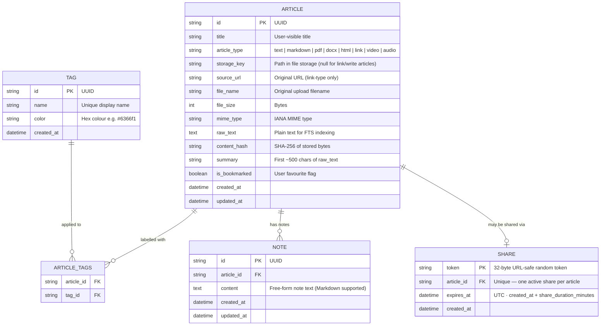
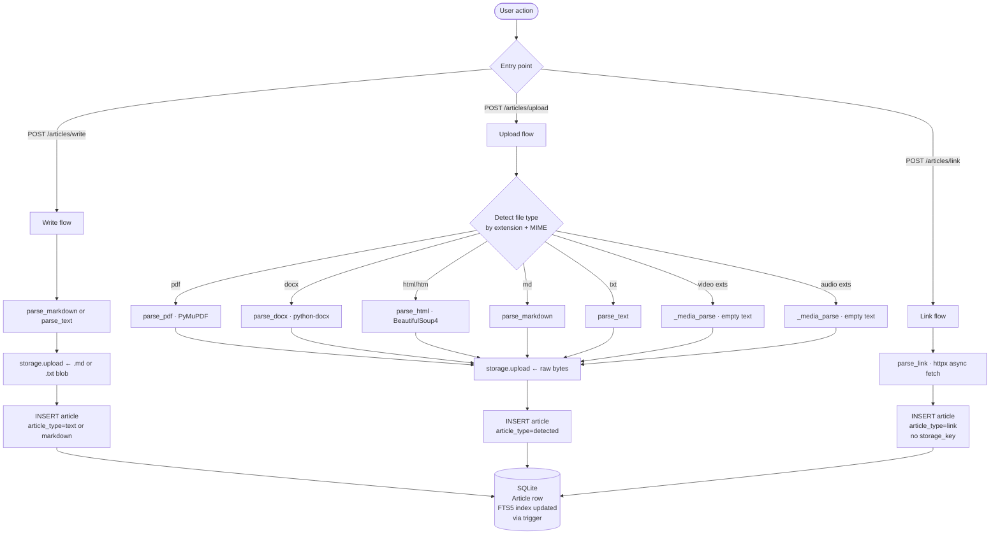

# Domain Model

> **Scope:** The core business entities, their attributes, relationships, and invariants — independent of any implementation technology.

---

## Entity Relationship Diagram

---

## Entity Descriptions

### Article
The central entity. Represents any piece of knowledge the user stores.

| Field | Notes |
|---|---|
| `article_type` | Determines how the content is stored, parsed, and rendered. `link` articles store only a URL and fetched text; `video`/`audio` articles store the binary file but have empty `raw_text`. |
| `storage_key` | Relative path inside the file storage backend. Null for `link` and `write` (text/markdown) articles that were created inline. |
| `raw_text` | Populated by the appropriate parser. Indexed in the FTS5 virtual table for full-text search. Empty for video/audio (binary-only). |
| `content_hash` | SHA-256 of the stored binary. Used to detect duplicate uploads. |
| `summary` | First ~500 characters of `raw_text`. Used for previews in the list pane without fetching the full content. |
| `is_bookmarked` | Boolean flag toggled per article. Drives the bookmark filter in the left pane. |

### Tag
A user-defined label that can be applied to multiple articles.

| Field | Notes |
|---|---|
| `name` | Must be unique across all tags. |
| `color` | Hex string displayed as a coloured pill badge. Chosen by the user in the TagManager. |

### Note
A free-form annotation scoped to a single article.

| Field | Notes |
|---|---|
| `content` | Markdown is accepted and rendered in the Notes pane. |
| Multiplicity | One article can have many notes; notes belong to exactly one article. Cascade-deleted with the article. |

### Share
A time-limited public access grant for one article.

| Field | Notes |
|---|---|
| `token` | Cryptographically random 32-byte URL-safe string. Forms the public URL `/public/{token}`. |
| `article_id` | UNIQUE constraint — only one active share per article at a time. Creating a new share renews the existing one (new token + new expiry). |
| `expires_at` | Set to `now + SHARE_DURATION_MINUTES` (default 30) at creation/renewal. Checked on every public access; expired shares are deleted on access. |

---

## Business Rules

| Rule | Enforced by |
|---|---|
| One share token per article at a time | UNIQUE constraint on `shares.article_id` |
| Expired share tokens are removed on access | `shares.py` router checks `expires_at < now()` and deletes before responding 410 |
| Tags and Notes are deleted when their Article is deleted | `CASCADE DELETE` on FKs |
| `article_tags` junction is cleaned up when either Article or Tag is deleted | `CASCADE DELETE` on both FKs |
| FTS5 index stays in sync with `articles.raw_text` | Three DDL triggers: `after_article_insert`, `after_article_update`, `after_article_delete` |
| File blobs are deleted from storage when an Article is deleted | `article_service.delete_article()` calls `storage.delete(article.storage_key)` before the DB row is removed |
| Upload size limit | `MAX_UPLOAD_MB` env var (default 500 MB) enforced in the articles router |

---

## Article Type Lifecycle

